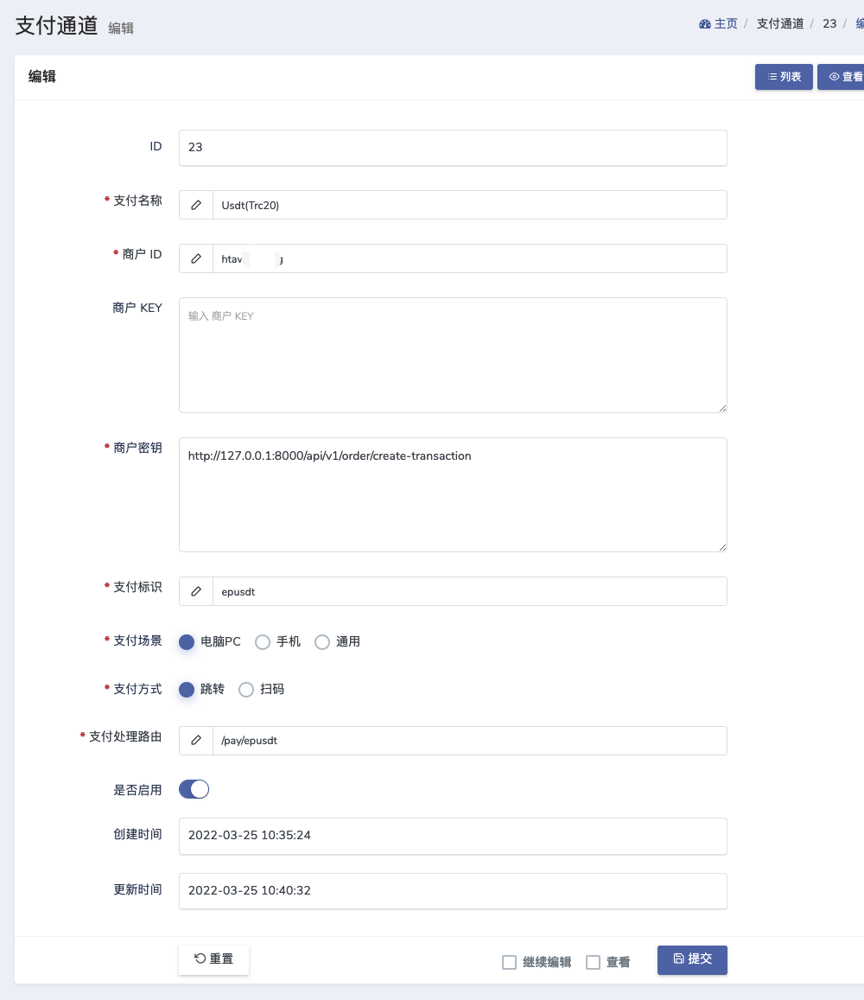

## 使用方法
### 注意此插件仅适用于独角数卡2.0.4版本以下，2.0.4版本或以上的独角数卡已经内置此插件，无需配置

1.将`app`和`routes`目录覆盖到网站根目录。      
2.在独角数卡后台添加一个支付方式。      

| 支付选项 | 商户id | 商户key | 商户密钥 | 备注 |     
| :-----| :----- | :----- | :----- |:-----|       
| Epusdt | api接口认证token	 | 空 | epusdt收银台地址+/api/v1/order/create-transaction| 如果独角数卡和epusdt在同一服务器则填写`127.0.0.1`不要填域名，例如`http://127.0.0.1:8000/api/v1/order/create-transaction` |             

示例：     
