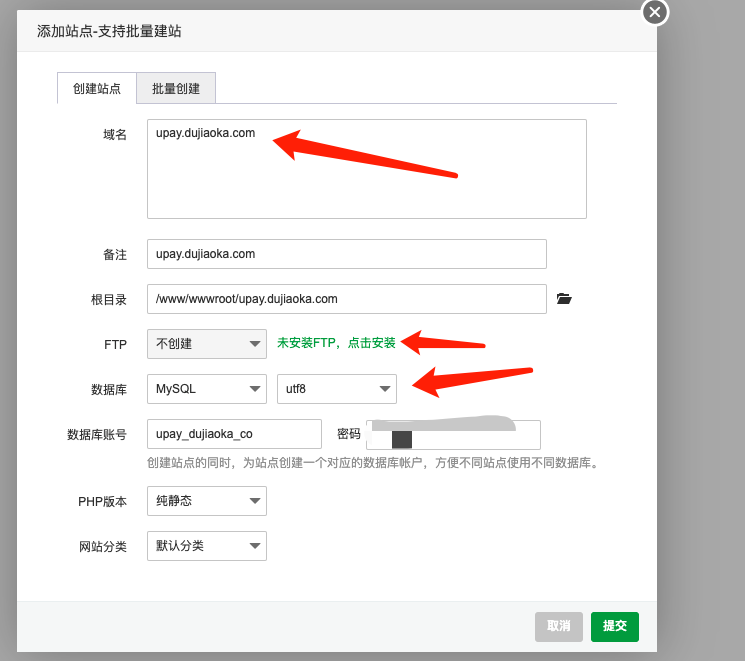
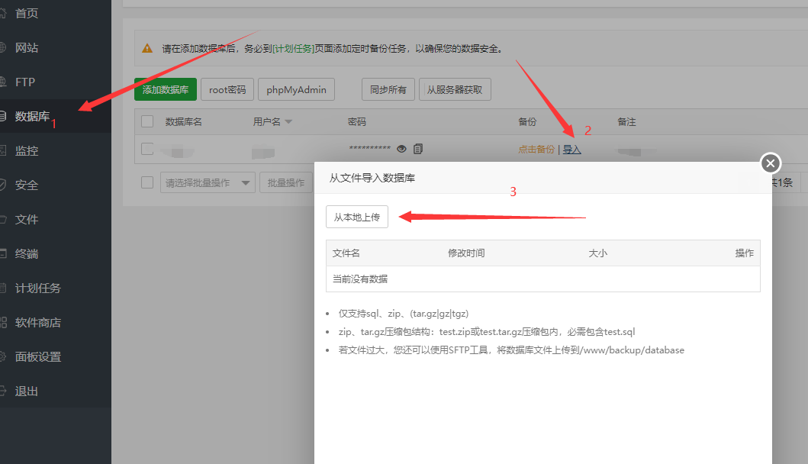
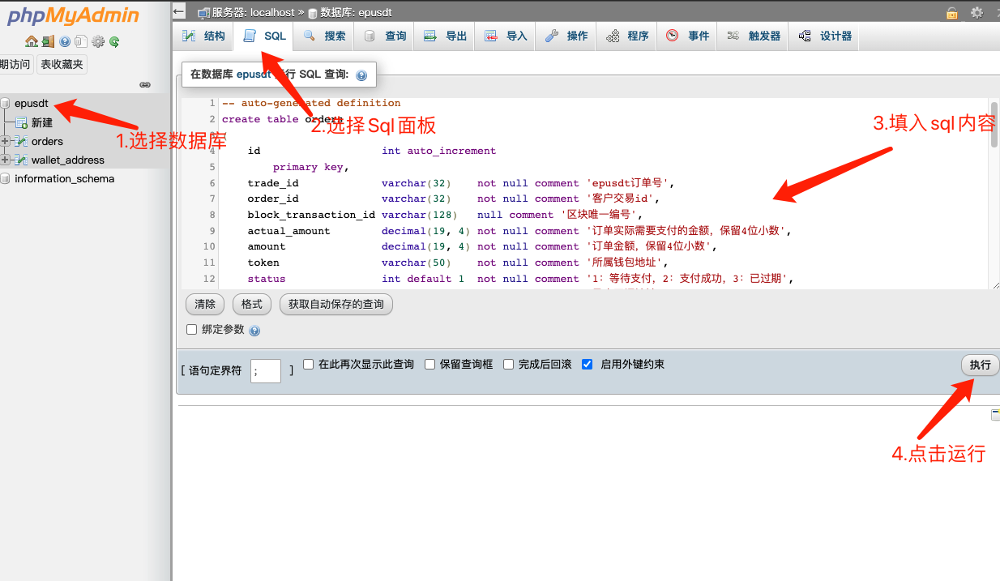
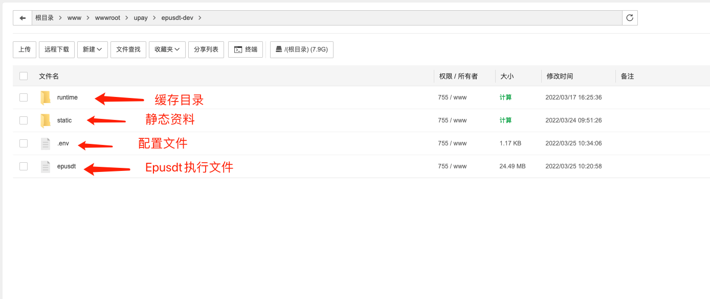
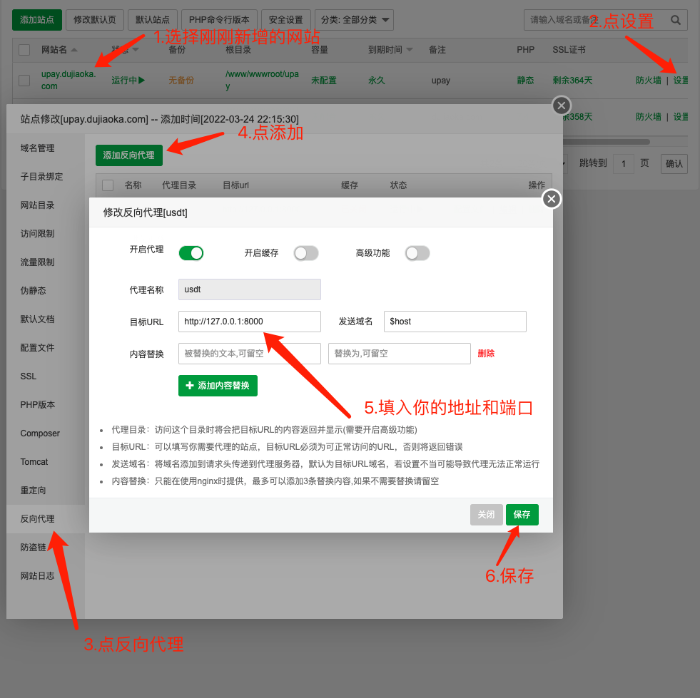
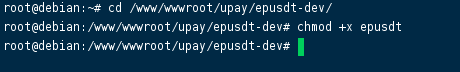
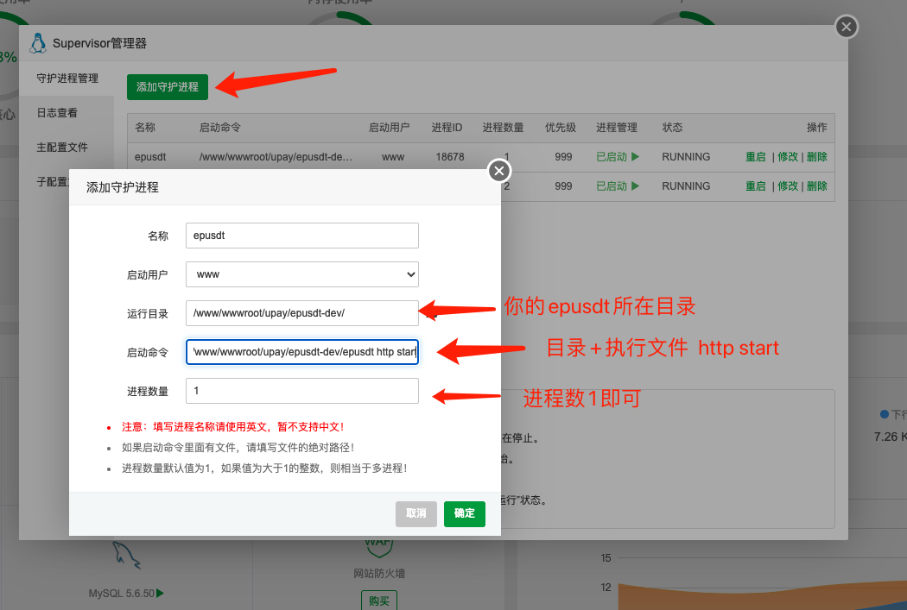
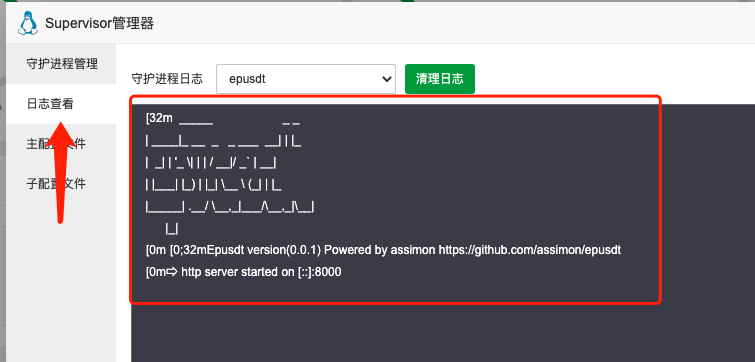
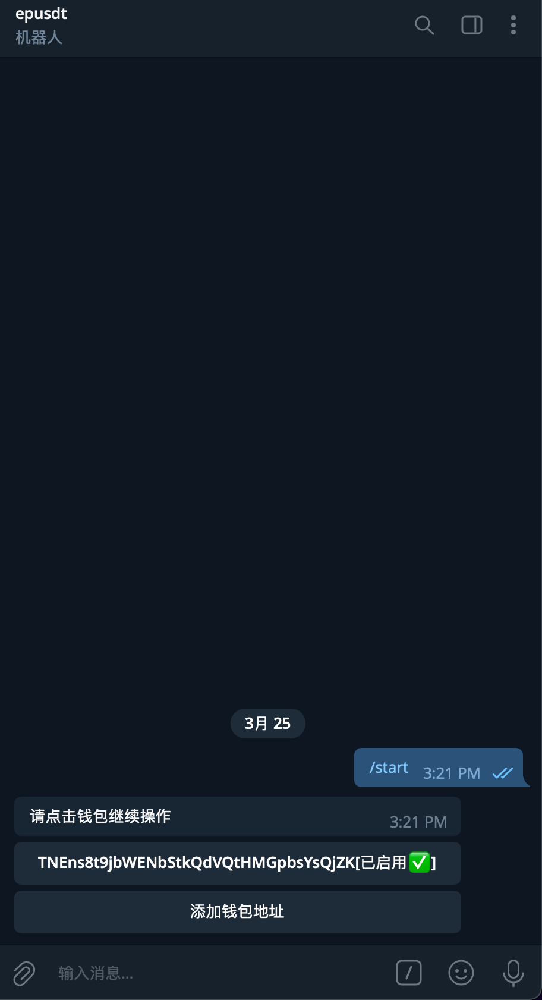

## 前言
本教程基于`宝塔`操作面板演示`Epusdt`如何运行，如果你未使用`宝塔`面板和有更强的服务器运维基础相信你也能根据教程的一些操作找到灵感！     

## 准备工作
- 请确保已经安装并启动了`Mysql`和`redis`、`Supervisord`服务
- 准备一个`telgeram`机器人🤖（用于操作你的钱包和接收交易通知），申请教程参考：[https://w37fhy.cn/2364.html](https://w37fhy.cn/2364.html)
- 准备一个收银台域名，并完成解析(例如：`upay.dujiaoka.com`)。用于支付请求发起和扫码页面

## 开始使用
### 一、新增网站
在`宝塔`面板网站里新增一个网站，无需`php`和`ftp`纯静态即可，但是需要数据库！        
将提前解析好的收银台域名绑定。     


### 二、导入Sql
登录管理刚刚新增数据库，导入`Epusdt`所需的sql文件。 

以下为示范0.01版本 最新数据库请以 https://github.com/assimon/epusdt/blob/master/sql/ 为准

#### 1.手动下载导入

数据库地址:https://github.com/assimon/epusdt/blob/master/sql/v0.0.1.sql


#### 2.使用phpMyAdmin导入
使用文本编辑器打开`.sql`文件，如下：      
```sql
-- auto-generated definition
create table orders
(
    id                   int auto_increment
        primary key,
    trade_id             varchar(32)    not null comment 'epusdt订单号',
    order_id             varchar(32)    not null comment '客户交易id',
    block_transaction_id varchar(128)   null comment '区块唯一编号',
    actual_amount        decimal(19, 4) not null comment '订单实际需要支付的金额，保留4位小数',
    amount               decimal(19, 4) not null comment '订单金额，保留4位小数',
    token                varchar(50)    not null comment '所属钱包地址',
    status               int default 1  not null comment '1：等待支付，2：支付成功，3：已过期',
    notify_url           varchar(128)   not null comment '异步回调地址',
    redirect_url         varchar(128)   null comment '同步回调地址',
    callback_num         int default 0  null comment '回调次数',
    callback_confirm     int default 2  null comment '回调是否已确认？ 1是 2否',
    created_at           timestamp      null,
    updated_at           timestamp      null,
    deleted_at           timestamp      null,
    constraint orders_order_id_uindex
        unique (order_id),
    constraint orders_trade_id_uindex
        unique (trade_id)
);

create index orders_block_transaction_id_index
    on orders (block_transaction_id);

-- auto-generated definition
create table wallet_address
(
    id         int auto_increment
        primary key,
    token      varchar(50)   not null comment '钱包token',
    status     int default 1 not null comment '1:启用 2:禁用',
    created_at timestamp     null,
    updated_at timestamp     null,
    deleted_at timestamp     null
)
    comment '钱包表';

create index wallet_address_token_index
    on wallet_address (token);
```
复制-粘贴至`phpmyadmin`的SQL面板，然后执行       


### 三、配置Epusdt
1.将编译好的`Epusdt`项目压缩包上传至刚刚新增的网站目录，随后解压。    

2.将`.env.example`重命名为`.env`文件，这个是配置文件   
3.编辑`.env`文件，填入你的配置     
```dotenv
app_name=epusdt
#下面配置你的域名，收银台会需要
app_uri=https://upay.dujiaoka.com
#是否开启debug，默认false
app_debug=false
#http服务监听端口
http_listen=:8000

#静态资源文件目录
static_path=/static
#缓存路径
runtime_root_path=/runtime

#日志配置
log_save_path=/logs
log_max_size=32
log_max_age=7
max_backups=3

# mysql配置
mysql_host=127.0.0.1
mysql_port=3306
mysql_user=mysql账号
mysql_passwd=mysql密码
mysql_database=数据库
mysql_table_prefix=
mysql_max_idle_conns=10
mysql_max_open_conns=100
mysql_max_life_time=6

# redis配置
redis_host=127.0.0.1
redis_port=6379
redis_passwd=
redis_db=5
redis_pool_size=5
redis_max_retries=3
redis_idle_timeout=1000

# 消息队列配置
queue_concurrency=10
queue_level_critical=6
queue_level_default=3
queue_level_low=1

#机器人Apitoken
tg_bot_token=
#telegram代理url(大陆地区服务器可使用一台国外服务器做反代tg的url)，如果运行的本来就是境外服务器，则无需填写
tg_proxy=
#管理员userid
tg_manage=

#api接口认证token(用于发起交易的签名认证，请勿外泄)
api_auth_token=

#订单过期时间(单位分钟)
order_expiration_time=10

#强制汇率(设置此参数后每笔交易将按照此汇率计算，例如:6.4)
forced_usdt_rate=
```
4. ⚠️注意：配置文件里面不认识的不要修改，留空即可，不会改又要瞎改，除非你对项目源代码很熟悉很有信心😁

### 四、配置反向代理
由于`Epusdt`会自动开启`http`服务并监听配置端口，所以可以直接用ip访问，例如: `http://127.0.0.1:8000`。     
这会显得非常不美观，还没有https。     
所以我们需要借助nginx的`反向代理`来为`Epusdt`绑定一个域名        
点击`宝塔`->`网站`->点击刚刚新增网站的`设置`->反向代理设置    


### 五、赋予Epusdt执行权限
`linux`服务器需要赋予`Epust`执行权限方可启动。      
1.通过`ssh`进入服务器终端      
2.进入`epusdt`可执行文件所在目录（目录位置可以参考宝塔面板的网站根目录）       
3.执行命令```chmod +x epusdt```赋予权限(根据你的实际目录来，不用一比一抄我的，每个人的目录都不一样)     



### 六、配置supervisor
为了保证`Epusdt`常驻后台运行，我们需要配置`supervisor`来实现进程监听        
打开`宝塔supervisor`，添加守护进程     

启动命令为：epusdt所在目录+epusdt执行文件+空格+http+空格+start(例如：`/www/wwwroot/upay/epusdt-dev/epusdt http start`)       
出现如下图则代表成功：     


### 七、测试
以上步骤完成无误后，进入`telegram`机器人🤖，如果机器人有反馈则代表运行正常！     



## 其他注意事项
- 1.所有`.env`配置文件有了修改后都需要重启supervisor进程
- 2.教程所示的目录均为参考，请勿1:1照抄，根据自己实际情况来
- 3.`windows`与`linux`不同，`windows`请直接运行`epusdt.exe`即可，无需赋予执行权限
